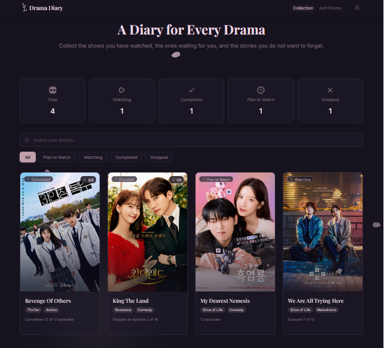
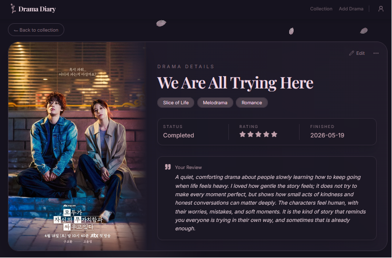
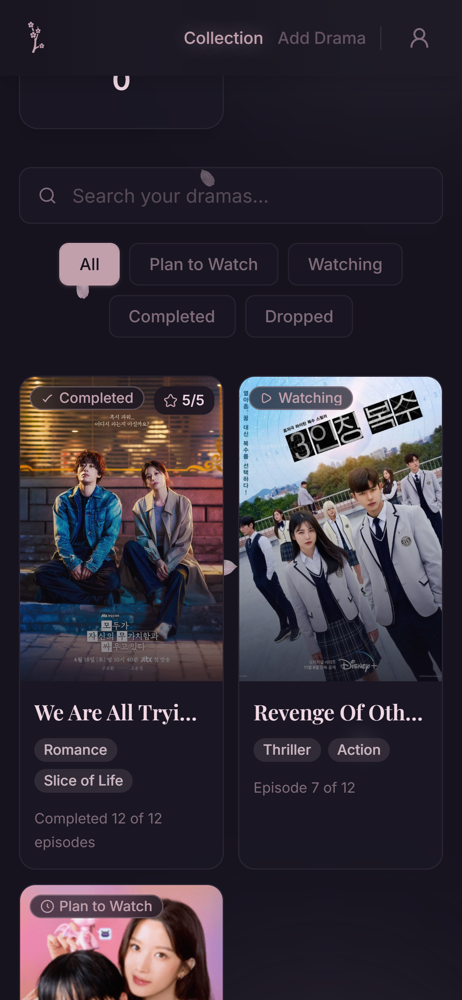

# Drama Diary

Drama Diary is a responsive K-drama journal built with React and TypeScript. It lets users organize a personal drama collection, track viewing progress and status, and record ratings, reviews, genres, episode progress, and completion dates.

This repository currently contains the frontend application. Data and demo accounts are stored in the browser with `localStorage`; an ASP.NET Core Web API backend is planned as the next development phase.

## Live Demo

**Demo:** https://drama-diary-app.vercel.app/

> The deployed app is a portfolio demo. Do not use a real or reused password.

## Features

- Create a demo account and maintain a persisted browser session
- Access the journal through protected routes
- Add, edit, view, and delete drama entries
- Track plan-to-watch, watching, completed, and dropped statuses
- Record episode progress, ratings, completion dates, genres, and reviews
- Search the collection and filter it by watch status
- View collection statistics by status
- Keep drama collections separated by demo user
- Restore account and drama data after a browser refresh
- Use responsive layouts designed for desktop and mobile screens
- Fall back to a default poster when an image is unavailable

## Tech Stack

- **UI:** React 19, TypeScript, Tailwind CSS
- **State:** Redux Toolkit, React Redux, listener middleware
- **Routing:** React Router
- **Components:** Radix UI, shadcn-style UI primitives
- **Icons:** Lucide React, Hugeicons
- **Persistence:** Browser `localStorage`
- **Forms and dates:** Controlled React forms, React DatePicker
- **Testing:** Vitest, Testing Library, jest-dom
- **Tooling:** Vite, ESLint
- **Deployment:** Vercel

## Authentication Note

Authentication is intentionally **mock/demo-only**. Registered users, plaintext demo passwords, and the current session are stored in `localStorage`.

This approach is useful for demonstrating frontend authentication flows, persisted sessions, protected routes, and user-specific state, but it is not secure production authentication. Browser storage can be inspected and modified by the user, and it does not provide a trusted authorization boundary.

The planned ASP.NET Core backend will replace this implementation with server-side identity, secure password hashing, API-based authorization, and persistent database storage.

## Project Structure

```text
src/
|-- app/                    # Application router and Redux store
|-- components/
|   |-- layout/             # Shared authentication and application layouts
|   |-- ui/                 # Reusable UI primitives
|   `-- visual/             # Decorative visual components
|-- features/
|   |-- auth/
|   |   |-- components/     # Authentication route guards
|   |   |-- pages/          # Login and signup pages
|   |   |-- services/       # Mock authentication operations
|   |   |-- store/          # Authentication Redux logic
|   |   |-- types/          # Authentication types
|   |   `-- utils/          # Authentication storage helpers
|   `-- dramas/
|       |-- components/     # Drama forms, cards, lists, and filters
|       |-- constants/      # Drama-related constants and helpers
|       |-- pages/          # Collection, details, add, and edit pages
|       |-- store/          # Drama Redux logic and persistence listener
|       |-- types/          # Drama domain types
|       `-- utils/          # Drama builders and storage validation
|-- hooks/                  # Typed Redux hooks
|-- lib/                    # Shared utilities
|-- styles/                 # Global Tailwind theme and styles
`-- test/                   # Shared test setup
```

## Run Locally

### Prerequisites

- Node.js 20 or later
- npm

### Installation

```bash
git clone https://github.com/nohatabikh/kdrama-evaluation.git
cd kdrama-evaluation
npm install
npm run dev
```

Open the local URL shown by Vite, usually `http://localhost:5173`.

## Available Scripts

| Command              | Description                                          |
| -------------------- | ---------------------------------------------------- |
| `npm run dev`        | Start the Vite development server                    |
| `npm run build`      | Type-check the project and create a production build |
| `npm run preview`    | Preview the production build locally                 |
| `npm run lint`       | Run ESLint across the project                        |
| `npm test`           | Run the Vitest test suite once                       |
| `npm run test:watch` | Run Vitest in watch mode                             |

## Testing and Build Status

The project currently includes automated coverage for:

- Mock signup, login, logout, and password validation
- Authentication Redux behavior
- Drama reducers and localStorage persistence middleware
- Per-user drama storage isolation and stored-data validation
- Drama creation and update rules
- Safe JSON parsing

At the latest repository review:

- ESLint passed
- TypeScript validation passed
- All 66 Vitest tests passed

Run the current checks locally with:

```bash
npm run lint
npm test
npm run build
```

## Roadmap

- Connect authentication and drama management to an ASP.NET Core Web API
- Add database-backed user accounts and drama entries
- Replace mock authentication with secure server-managed authentication
- Add API request loading, error, and retry states when backend integration begins
- Add route and component integration tests
- Add route-level code splitting and optimize image assets
- Add richer sorting, filtering, and journal fields
- Add continuous integration for linting, tests, and production builds

## Screenshots

### Collection Dashboard



### Drama Details



### Mobile Layout



## Backend Roadmap

An ASP.NET Core Web API is planned as future work. The backend will provide the long-term boundary for authentication, authorization, validation, user-specific drama data, and database persistence.

Until that integration is complete, Drama Diary should be treated as a frontend portfolio demo. Accounts, sessions, and journal data remain local to the current browser and device.
